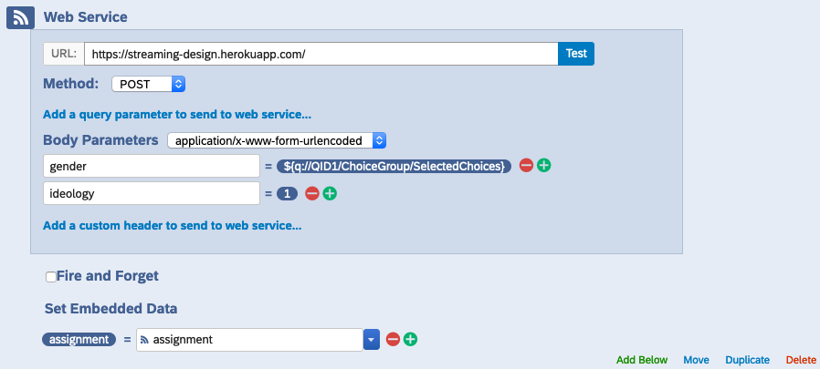

# Web Application for Streaming Experimental Design

## Table of Contents

  * [Clone this repository](#clone-this-repository)
  * [Install Heroku CLI](#install-heroku-cli)
  * [Enable Heroku beta version](#enable-heroku-beta-version)
  * [Make any changes for your application](#make-any-changes-for-your-application)
  * [Update Qualtrics survey design](#update-qualtrics-survey-design)
  * [How to modify the setup](#how-to-modify-the-setup)
    + [`Dockerfile`](#dockerfile)
    + [`covariates.yml`](#covariatesyml)
    + [`.env`](#env)
  * [Development](#development)
 
To get a working server deployed via Heroku, take the following steps:

## Clone this repository
```
git clone git@github.com:ddimmery/streaming-design.git
```

## Install Heroku CLI
[Read the Heroku documentation for full details](https://devcenter.heroku.com/articles/heroku-cli). On a Mac, if you have Homebrew installed, run the command
```
brew tap heroku/brew && brew install heroku
```

## Enable Heroku beta version

Currently, to work with manifests in Heroku, it's [necessary to use the beta version](https://devcenter.heroku.com/articles/build-docker-images-heroku-yml#creating-your-app-from-setup).

```
heroku update beta
heroku plugins:install @heroku-cli/plugin-manifest
heroku create <YOUR APP NAME> --manifest
```

## Make any changes for your application

In particular, it will be necessary to update the `covariates.yml` definition to spell out how covariates should be encoded.

Commit your changes and push the code to Heroku.

```
git add .
git commit -m "An informative commit message!"
git push heroku main
```

## Update Qualtrics survey design

To use your app in Qualtrics to implement streaming experimental design, you will need to go into the "Survey Flow" mode and add [an element corresponding to a Web Service](https://www.qualtrics.com/support/survey-platform/survey-module/survey-flow/advanced-elements/web-service/#AddingAWebService). It should be set up like the following:



Make sure that this element is added after you have collected all the covariates you wish to balance on and before you implement the "treatment" of your survey experiment.

You want to put the appropriate web address of your application in the first box, then select the `POST` method and add each of your covariates as a body parameter. These should be set to be sent as `application/x-www-form-urlencoded`. To add a covariate, type the name of the covariate as defined in your `covariates.yml` file and then select that the value should be filled using `Insert Piped Text > Survey Question > <NAME OF SURVEY QUESTION> > Selected Choices Recode`.

If you have a covariate that should be mapped to a continuous parameter, make sure that you set up the recoding to map responses to the desired numeric value.
 
## How to modify the setup

There are a few places where you may want to modify settings to your liking.

### `Dockerfile`

To set how to process your data and which streaming design you want to use, you'll need to modify the lines in the `Dockerfile` which set the following two environment variables:

```
ENV DESIGN_NAME=bwd
ENV PROCESSOR_NAME=config
```

There are currently two options for design `simple` for simple randomization and `bwd` for an algorithm which seeks linear balance on covariates.

There is only one option available for processors, `config`. This requires handwriting a `YAML` file with a description of your covariates.

### `covariates.yml`

This file defines the levels and types of your covariates. An example using only two covariates is provided:

```
gender:
  - Male
  - Female
  - Non-binary
  - Other
ideology: float
```

The variable `gender` is a discretely valued covariate which will be one-hot encoded with four levels. Note the indentation and the dash to indicate a list.

The variable `ideology` is taken to be defined as a float, which means that it should be provided as a numeric value.

With the default processor, missing values are not supported, and unexpected input may cause the app to crash.

### `.env`

For local development, you may need to modify the `.env` file defining how the local version of the app should be loaded.

## Development

For local development, (after cloning this repo) you'll want to first create a `.env` file in the base directory. Mine looks like the following:

```
MODE='dev'
FLASK_APP='design_app'
FLASK_ENV='env_design_${MODE}'
DESIGN_NAME=bwd
PROCESSOR_NAME=config
DATABASE_URL='postgresql://design:design@db:5432/design_db'
```

If you don't want to bother with PostgreSQL, you can replace the URL with `sqlite:///test.db` to just use SQLite for testing.

Commit to the git repository as usual and test locally by building the docker container:

```
docker-compose -f docker-compose.yml up --build
```

When you are satisfied with your changes, test in Heroku by creating an app and pushing:

```
heroku create streaming-design --manifest
```

As you make changes, update the code on Heroku by committing and then pushing with:
```
git push heroku main
```

If you make changes to the setup section in `heroku.yml`, note that you will need to re-provision the app in order for the changes to manifest, i.e.:
```
heroku apps:destroy

heroku create <YOUR APP NAME> --manifest
```
